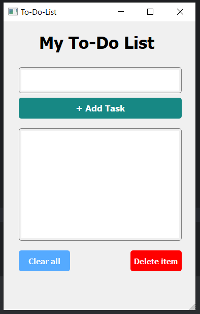

📝 PyQt5 To-Do List App

A simple and clean To-Do List application built with Python and PyQt5.
This app allows users to add tasks, delete selected tasks, and clear the entire list.
Perfect as a beginner-friendly GUI project.

🚀 Features

➕ Add Tasks
Type your task in the input box and add it to your list.

🗑️ Delete Tasks
Select a task in the list and remove it with one click.

🔄 Clear All Tasks
Remove all tasks from the list instantly.

🎨 PyQt5 GUI
Uses a .ui file created in Qt Designer for a clean interface.

🧰 Requirements

Make sure you have these installed:

```bash
pip install pyqt5  
```

🧠 Code Overview
Main components:

Task class → Represents a single task

TodoList class → Manages all tasks (add, delete, clear)

UI class → Loads the PyQt5 interface and connects buttons to functions

 
